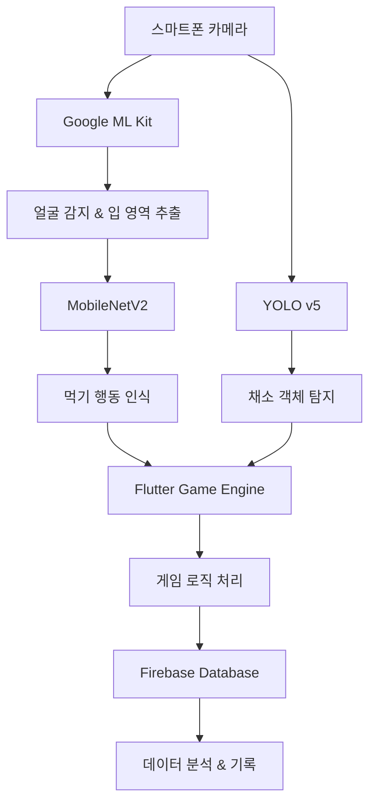

# FoodHabitGame

# 냠냠쩝쩝팡팡 🥬🎮
### AI 기반 어린이 식습관 개선 게임

[](https://flutter.dev/)
[](https://firebase.google.com/)
[](https://www.tensorflow.org/)
[](https://yolov5.readthedocs.io/)

## 📋 프로젝트 개요

**냠냠쩝쩝팡팡**은 4~8세 어린이의 편식 문제를 해결하기 위해 개발된 AI 기반 모바일 게임입니다. 스마트폰의 전면 카메라를 활용하여 아이의 식사 행동을 실시간으로 인식하고, 게임화 기법을 통해 자연스럽게 올바른 식습관을 형성하도록 돕습니다.

### 🎯 주요 문제 해결
- **편식 문제**: 학부모 10명 중 7명이 겪는 자녀의 편식 문제
- **낮은 식사 집중도**: 식사 시간 동안의 집중력 부족
- **부모 스트레스**: 식사 시간으로 인한 부모-자녀 간 갈등

## ✨ 주요 기능

### 🤖 AI 기반 실시간 인식
- **채소 인식**: YOLO 모델을 활용한 13가지 채소 실시간 탐지
- **먹기 인식**: MobileNetV2 기반 먹는 행동 감지
- **Google ML Kit**: 얼굴 탐지를 통한 입 주변 영역 추출

### 🎮 게임 메커니즘
- **에너지 시스템**: 먹기 동작으로 캐릭터 에너지 충전
- **일반 공격**: 기본 먹기 행동으로 적 공격
- **특수 공격**: 채소 섭취 시 보스 몬스터 처치
- **보상 시스템**: 골드 획득 및 성취감 제공

### 📊 데이터 관리
- **연령별 목표 설정**: WHO 기준 연령별 채소 권장 섭취량
- **일별 기록**: Firebase 연동 식사 기록 저장
- **진행 상황 추적**: 캘린더 형태의 식습관 기록 확인

## 🛠️ 기술 스택

### Frontend
- **Flutter**: 크로스 플랫폼 모바일 앱 개발
- **Flame Engine**: 2D 게임 엔진

### Backend & Database
- **Firebase**: 실시간 데이터베이스 및 인증
- **Firebase Analytics**: 사용자 행동 분석

### AI/ML
- **YOLO v5**: 실시간 객체 탐지 (채소 인식)
- **MobileNetV2**: 경량화된 이미지 분류 (먹기 인식)
- **Google ML Kit**: 얼굴 감지 및 특징점 추출
- **TensorFlow Lite**: 모바일 AI 모델 최적화

### 데이터셋
- **채소 데이터**: Roboflow 다양한 채소 데이터셋 (13개 클래스)
- **먹기 데이터**: 자체 제작 라벨링 프로그램으로 8,500장 수집

## 📱 주요 화면

### 게임 플레이
```
🎮 게임 시작 → 👶 나이 설정 → 🥬 목표 채소 설정 → ⚔️ 전투 시작
                                                        ↓
🏆 결과 확인 ← 📊 데이터 저장 ← 🥕 채소 섭취 ← 🍽️ 먹기 인식
```

### 주요 기능 플로우
1. **로그인 및 설정**: 사용자 인증 및 아이 나이 설정
2. **목표 설정**: 연령별 권장 채소 섭취량 자동 계산
3. **게임 플레이**: 실시간 AI 인식을 통한 인터랙티브 게임
4. **결과 기록**: 섭취한 채소 종류 및 개수 Firebase 저장
5. **진행 추적**: 캘린더 형태로 일별 식습관 기록 확인

## 🏗️ 시스템 아키텍처



## 🚀 설치 및 실행

### 사전 요구사항
- Flutter SDK 3.0+
- Android Studio / Xcode
- Firebase 프로젝트 설정

### 설치 방법

1. **저장소 클론**
```bash
git clone https://github.com/your-username/yumyum-chomp-chomp.git
cd yumyum-chomp-chomp
```

2. **의존성 설치**
```bash
flutter pub get
```

3. **Firebase 설정**
```bash
# Firebase CLI 설치 후
firebase login
flutterfire configure
```

4. **AI 모델 다운로드**
```bash
# assets/models/ 디렉토리에 모델 파일 배치
# - vegetable_detection.tflite (YOLO 채소 인식 모델)
# - eating_recognition.tflite (MobileNetV2 먹기 인식 모델)
```

5. **앱 실행**
```bash
flutter run
```

## 📊 성능 및 결과

### AI 모델 성능
- **채소 인식 정확도**: 95%+ (13개 채소 클래스)
- **먹기 인식 정확도**: 92%+ (다양한 각도 대응)
- **실시간 처리 속도**: 10-15 FPS

### 데이터셋 규모
- **채소 이미지**: 5,000+ 장 (Roboflow 데이터셋)
- **먹기 행동**: 8,500+ 장 (자체 수집 및 라벨링)

### 지원 채소 종류
🥬 양배추, 🥕 당근, 🥒 오이, 🍅 토마토, 🥦 브로콜리, 🌶️ 피망, 🌽 옥수수, 🧅 양파, 🥔 감자, 🍆 가지, 🥬 상추, 🫑 파프리카, 🥒 호박

## 📈 기대 효과

### 어린이
- ✅ 편식 습관 개선
- ✅ 식사 집중력 향상
- ✅ 다양한 채소에 대한 긍정적 경험
- ✅ 균형 잡힌 영양 섭취

### 부모
- ✅ 식사 시간 스트레스 감소
- ✅ 강제적 훈육에서 자발적 참여로 전환
- ✅ 객관적 식습관 모니터링
- ✅ 부모-자녀 관계 개선

## 🔬 연구 기반

본 프로젝트는 다음 연구 결과를 바탕으로 개발되었습니다:
- **유럽 비만학회(EOC)**: 보상 시스템을 통한 채소 섭취 증가 연구
- **CJ 프레시웨이(2024)**: 학부모 70%가 자녀 편식 문제 우려
- **게임화 인게이지먼트 루프**: 동기-액션-보상 순환 구조

## 🚀 향후 계획

### 단기 목표 (6개월)
- [ ] 추가 채소 종류 확장 (20개 → 30개)
- [ ] 모델 경량화 및 성능 최적화
- [ ] 다국어 지원 (영어, 일본어)

### 중기 목표 (1년)
- [ ] 개인 맞춤형 영양 분석 시스템
- [ ] 가족 소셜 기능 추가
- [ ] 교육기관 연계 서비스

### 장기 목표 (2년+)
- [ ] 다른 생활습관 영역 확장 (수면, 운동, 위생)
- [ ] 특수 대상군 지원 (발달장애 아동 등)
- [ ] 의료기관 연계 서비스

## 👥 팀 구성

| 이름 | 역할 | 전공 | 학번 |
|------|------|------|------|
| 김소정 | 게임 기획 및 개발 | 인공지능전공 | 202235022 |
| 손찬수 | 채소 인식 AI | 인공지능전공 | 202239875 |
| 최성민 | 먹기 인식 AI | 인공지능전공 | 202035547 |

## 📄 라이선스

이 프로젝트는 [MIT License](LICENSE)를 따릅니다.

## 🤝 기여하기

프로젝트에 기여하고 싶으시다면:

1. Fork the Project
2. Create your Feature Branch (`git checkout -b feature/AmazingFeature`)
3. Commit your Changes (`git commit -m 'Add some AmazingFeature'`)
4. Push to the Branch (`git push origin feature/AmazingFeature`)
5. Open a Pull Request

## 📞 연락처

프로젝트 관련 문의사항이 있으시면 언제든 연락주세요!

- 📧 Email: sowjdrla@gmail.com
- 🐛 Issues: [GitHub Issues](https://github.com/your-username/yumyum-chomp-chomp/issues)

---

**냠냠쩝쩝팡팡**과 함께 아이들의 건강한 식습관을 만들어보세요! 🌟
